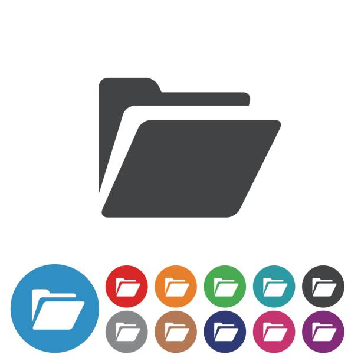

<a name="readme-top"></a>

<div align="center">
  
  <br/>
  <h1><b>Portfolio</b></h1>
</div>

# 📗 Table of Contents

- [📖 About the Project](#about-project)
  - [🛠 Built With](#built-with)
    - [Tech Stack](#tech-stack)
    - [Key Features](#key-features)
  - [🚀 Live Demo](#live-demo)
  - [🚀 Presentation](#presentation)  
- [💻 Getting Started](#getting-started)
  - [Setup](#setup)
  - [Prerequisites](#prerequisites)
  - [Install](#install)
  - [Usage](#usage)
  - [Run tests](#run-tests)
  - [Deployment](#triangular_flag_on_post-deployment)
- [👥 Authors](#authors)
- [🔭 Future Features](#future-features)
- [🤝 Contributing](#contributing)
- [⭐️ Show your support](#support)
- [🙏 Acknowledgements](#acknowledgements)
- [❓ FAQ](#faq)
- [📝 License](#license)


# 📖 SWING DANCE STYLES AND STEPS LIBRARY <a name="about-project"></a>

This is the Capstone Project for the 1st module at Microverse

## 🛠 Built With <a name="built-with"></a>

### Tech Stack <a name="tech-stack"></a>

<details>
  <summary>Text Editor</summary>
  <ul>
    <li><a href="https://code.visualstudio.com/">Visual Studio Code</a></li>
  </ul>
</details>

<details>
  <summary>Client</summary>
  <ul>
    <li><a href="https://html.com/">HTML</a></li>
  </ul>
</details>

<details>
  <summary>Style</summary>
  <ul>
    <li><a href="https://lenguajecss.com/">CSS</a></li>
  </ul>
</details>


### Key Features <a name="key-features"></a>

- **Home Page**
- **About Page**
- **Featured Teachers**

<p align="right">(<a href="#readme-top">back to top</a>)</p>


## 🚀 Live Demo <a name="live-demo"></a>

Try it with <a href="https://mar12358.github.io/capstone-lh">gh-pages</a>

<p align="right">(<a href="#readme-top">back to top</a>)</p>

## 🚀 Presentation <a name="presentation"></a>

See this <a href="https://www.loom.com/share/b5bb67f5bc9842f69eb0e5038309bf28">walkthrough video</a> communicating some technical concepts.

<p align="right">(<a href="#readme-top">back to top</a>)</p>


## 💻 Getting Started <a name="getting-started"></a>


### Prerequisites

- Editor
- Web browser
- GitHub

### Setup

To clone this repository to your local machine, open a terminal and select desired folder:
```sh
  cd capston-lh-folder
```
Clone:
```sh
  git clone https://github.com/Mar12358/Portfolio.git
```


### Install
N/A


### Usage
- To visualize the project, open it by launching the Live Server plugging in visual studio code.


<p align="right">(<a href="#readme-top">back to top</a>)</p>

## 👥 Authors <a name="authors"></a>
<br>


👤 **Martín Ezequiel González**

- GitHub: [@Mar12358](https://github.com/Mar12358)
- Twitter: [@MarezegonZ](https://twitter.com/MarezegonZ)
- LinkedIn: [Martin Ezequiel Gonzalez](https://www.linkedin.com/in/martin-ezequiel-gonzalez-30a413260/)


<p align="right">(<a href="#readme-top">back to top</a>)</p>

## 🔭 Future Features <a name="future-features"></a>

- **Join form**
- **Add library**
- **Add news**

<p align="right">(<a href="#readme-top">back to top</a>)</p>

## 🤝 Contributing <a name="contributing"></a>

Contributions are welcome!

Feel free to check the [issues page](https://github.com/Mar12358/capstone-lh/issues).

<p align="right">(<a href="#readme-top">back to top</a>)</p>

## ⭐️ Show your support <a name="support"></a>
Nothing can stop success!

Give a ⭐️ if you like this project!

<p align="right">(<a href="#readme-top">back to top</a>)</p>

## 🙏 Acknowledgments <a name="acknowledgements"></a>
**Original design idea by Cindy Shin in Behance.**
- Behance: [@adagio07](https://www.behance.net/adagio07)
- LinkedIn: [@adagio07](https://www.linkedin.com/in/adagio07/)
- Dribble: [@adagio07](https://dribbble.com/adagio07)

I would also like to thank all Microverse Team!

<p align="right">(<a href="#readme-top">back to top</a>)</p>

## ❓ FAQ <a name="faq"></a>


- **Are there such things as impossible things?**

  - ¡No! Only work to be done


<p align="right">(<a href="#readme-top">back to top</a>)</p>

## 📝 License <a name="license"></a>

This work is licensed under a <a rel="license" href="http://creativecommons.org/licenses/by-nc/4.0/">Creative Commons Attribution-NonCommercial 4.0 International License</a>.

<p align="right">(<a href="#readme-top">back to top</a>)</p>
